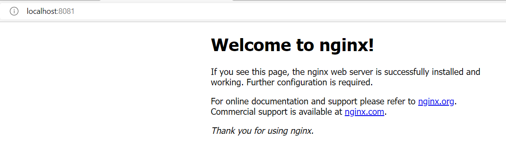
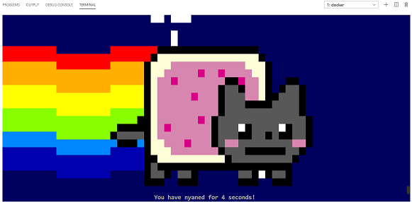
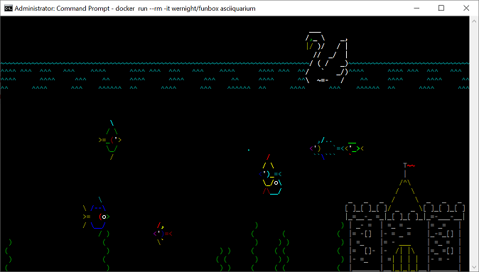

# AZ-204 Demo: Run Docker image locally

In the demo you will download and run Docker image locally.

## Technical requirements:

- Install [Docker Desktop](https://docs.docker.com/desktop/install/windows-install/)
- Pull image from Docker Hub by running commands from **demo.cli** 

### !!! The images are heavy ~1.5Gb, so download in advance !!!

## Demonstration:

1. Docker desktop must be run.
1. Open in VS Code **demo.azcli** and run line by line

1. Start local web site:

1. Cat in the space: 

1. Watch underwater: 

