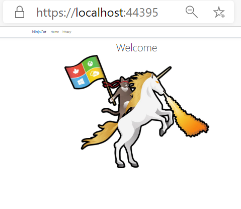
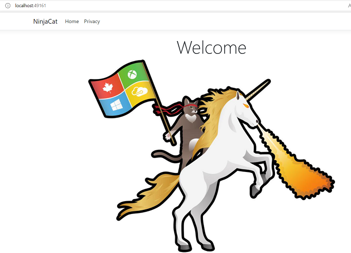

# AZ-204 Demo: Dockerfile and a building docker image.

In the demo you will create new image from web app project and push it in ACR

## Technical Requirements:

- Install Docker Desktop
- Visual Studio Core
- Net 5.0

## Demonstration:

1. Docker desktop must be run.

1. Open in VS Code folder **CSharp** and observer project.

1. Run the web site locally by use command **dotnet run**

    

1. Open `Dockerfile`

1. Open **run.azcli** to build image. Script should be executed in the project folder.

1. Run command from script line by line to build and tag the image.

1. Run the docker image locally to observe the result.

1. Open localhost to make sure that container created and run successful.

1. Run the command from script to push the image in ACR you previously deploy. 