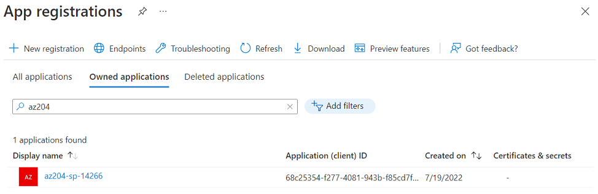

## AZ-204 Demo: Identities in Azure AD

In the demo you will create new Azure AD tenant and register new App and check the results form Azure portal.

## Technical Requirements:

- Visual Studio Code
- AZ CLI or CLoud Shell

## Demonstration:
 
1. Execute commands from [demo.azcli](demo.azcli) script to register App (service account)

1. From Azure portal verify the app with name Az204 and observer its permission for Microsoft Graph

    

## References

1. Create new Azure AD tenant as explained in following [tutorial](https://docs.microsoft.com/en-us/azure/active-directory/develop/quickstart-create-new-tenant)

1. Register new app for next integration as explained in following [tutorial](https://docs.microsoft.com/en-us/azure/active-directory/develop/quickstart-register-app)