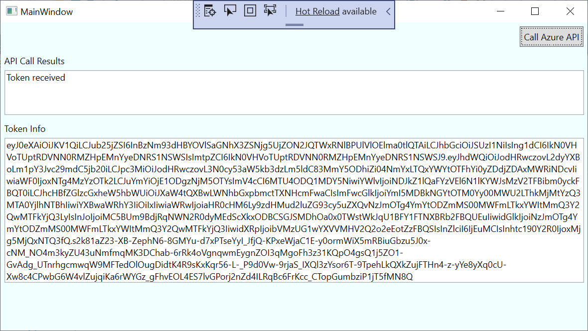

## AZ-204 Demo: Interactive authentication by using MSAL

In the demo you will run console client that use MSAL SDK to request token to Microsoft Graph.
You will validate created token. 

## Technical Requirements:

- Visual Studio 2022
- Net 5.0
- Windows App support

## Demonstration

1. Open **CSharp\DesktopClient** in VS 2022.

1. Update `CSharp\DesktopClient\App.xaml.cs` file with values from your tenant and App you registered in previous demo.

1. Run the project locally to pull the token info

    

1. Verify your token on [`https://jwt.ms/`](https://jwt.ms/)

