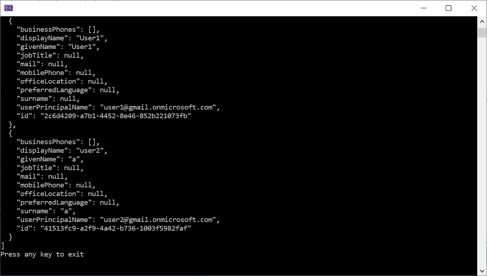

## AZ-204 Demo: Exploring Microsoft Graph Web API

In the demo you will use MSAL libraries to request token and access to Microsoft Graph to pull list of the users from ADD.

## Technical Requirements:

- Visual Studio Code
- Net 5.0
- App Registration account with access to AAD **Users.Read.All**

## Demonstration

1. Open **CSharp** folder in VS Code.

1. Update `appsettings.json` file with values from your tenant and App you registered in previous demos.

1. Run the project locally to pull the user list from Graph API

