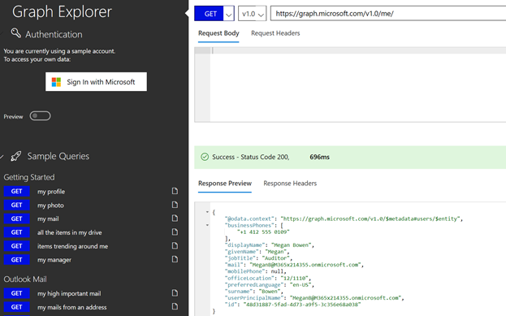
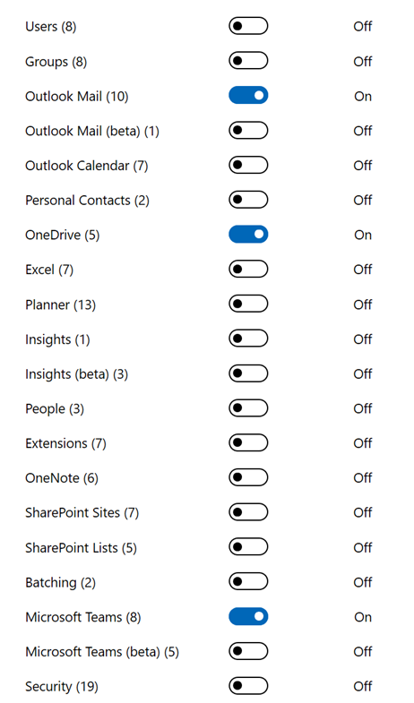

# AZ-204 Demo: Exploring Microsoft Graph Web API (Graph Explorer)

In the demo you will get access to the test Graph profile and demonstrate Graph API integration from Graph Explorer

## Demonstration:

1. Navigate to [Graph Explorer](https://developer.microsoft.com/en-us/graph/graph-explorer)
1. Optional sign-in with your account.
1. From the Graph Explorer select **/me** to pull info from your (or test) profile

    

1. Demonstrate additional options for integration such as 

    - OnDrive
    - Teams
    - Outlook

    

