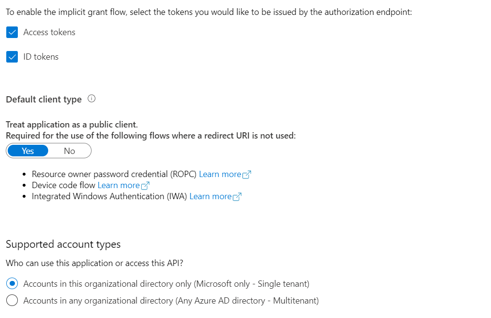
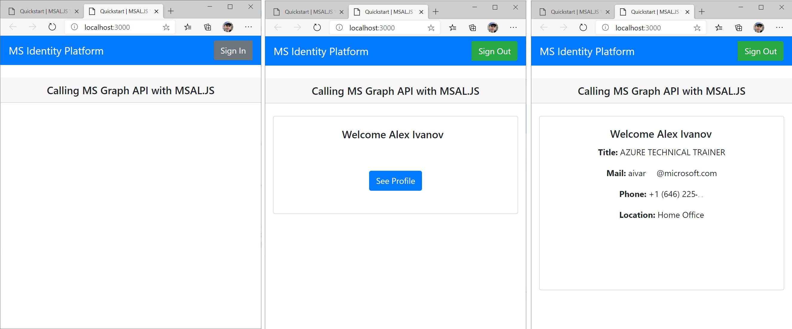

## AZ-204 Demo: Exploring Microsoft Graph Web API

In the demo you will use MSAL.JS libraries to request token and access to Microsoft Graph and pull your profile.

## Technical Requirement:

- Visual Studio Code
- Node 16
- App Registration account with access to AAD **Users.Read.All**
- Check your app registration settings:  
    

## Demonstration

1. Open **Nodejs** folder in VSCode.

1. Run local website command:  **node .\server.js**

1. Open browser on http://localhost:3000

1. Click "Sign in" button and pull data from Graph API

    

### User browser in private mode to avoid any automatic sign-in with your company's account!

