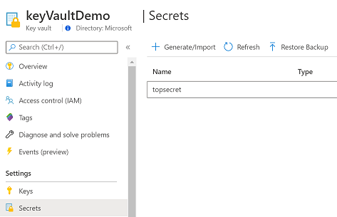

# AZ-204 Demo: Provision of Azure KeyVault from CLI

In the demo you will provision a new KeyVault and new secret. Then you grant your service account (app) permission to retrieve the secrets. The app will be used later to connect from code.

## Technical Requirements:
- VS Code
- Azure CLI or Cloud Shell
- AppID from existed the service account (previous module demo).

## Demonstration:

1. Update [**demo.azcli**](demo.azcli) with your AppID.
1. Execute commands form **demo.azcli** line by line.
1. Verify from portal the KeyVault and value of key "TopSecret"

    