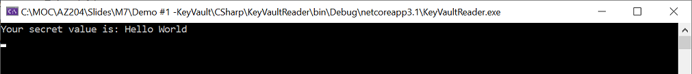

# AZ-204 Demo: Retrieving a secret from Azure Key Vault from SDK

In the demo you will retrieve the secret value from key vault you build on previous demo.

## Technical Requirements:

- KeyVault and Secret created from previous demo
- AppID of configured application with access to the secrets
- Visual Studio Code.
- Net 5.0

## Demonstration

1. Open in VS Code folder `CSharp`
1. Update `applicaiton.json` with parameters of your AppID, Tenant, App Secret and KeyVault name (from previous demo)
1. Run the code to pull the TopSecret value.

    

