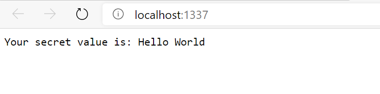

# AZ-204 Demo: Retrieving a secret from Azure Key Vault from SDK

In the demo you will retrieve the secret value from key vault you build on previous demo.

## Technical Requirements:

- KeyVault and Secret created from previous demo
- AppID of configured application with access to the secrets
- Visual Studio Code.
- Node 16.0

## Demonstration:

1. Open folder **Nodejs** in the VS Code.
1. update **.env** with parameters of your appID, Tenant, App Secret, KeyVault name (from previous demo)
1. Run the project by command **node ./index.js**
1. The Web App will be started on http://localhost:1337
1. Observe the value of the secret you created on previous demo.

    

