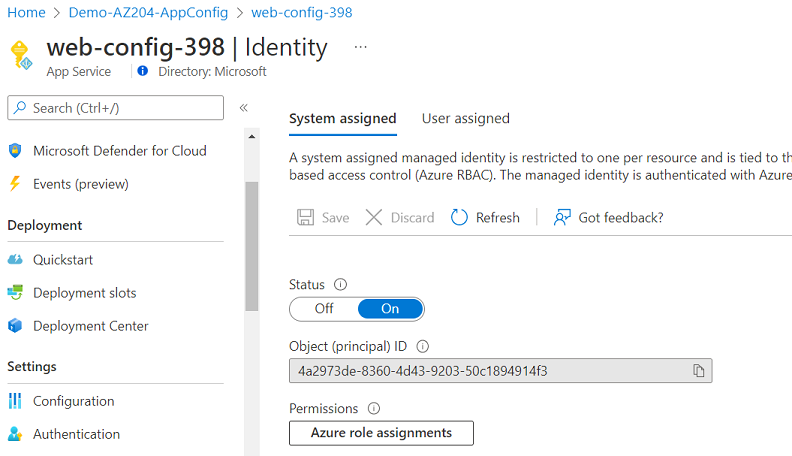

# AZ-204 Demo: Provision Managed Identities.

In the demo you will create web app and assign a system-assigned identity for access to the resources later. 

## Technical Requirements

 - Visual Studio Code
 - Azure CLI or CLoud Shell
 - Short name of keyvault from previous demo.

## Demonstration:
1. Open **demo.azcli** and update keyvault's name from previous demo.

1. Run the script line by line.

1. Copy ID from output

1. From the portal observer the identity:

    

1. From the key vault observe assignment: 

    