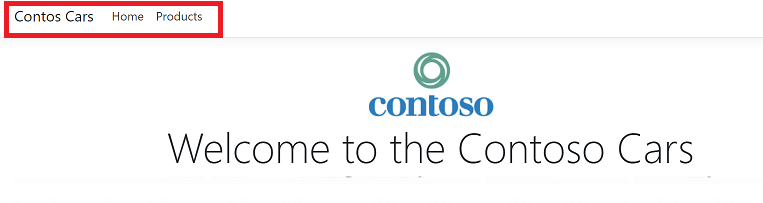
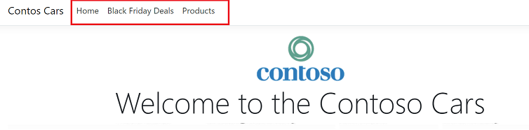

# AZ-203T04A-02 Demo #5: Explore App Configuration service

In the demo you will manage Feature Flag deployment.
You will deploy ContosoCars Azure webapp and App Configuration resource as well. 
You will update configuration settings to get web app connected to app configuration.

## Technical requirements:
- In the previous demo you deploy web app. You need to copy short name of the web app.
- Visual Studio Code
- dontet 3.1 (optional in case of rebuild the website)
- Azure CLI or CLoud Shell

## Demonstration 
1. Script need to be updated with web app name previously deployed.
1. Run script line by line to deploy src.zip to the website. If the rebuild required you can find source in [".\src"](./src/)
1. BlackFriday deals should be deployed as feature. When you open the web site first no Black Friday's deals should be visible

    

1. You can change the flag from code or from Azure Portal:

    

1. The Web up should be restarted by CLI command and new versions with deals should be visible.

    

## References

Code tutorial [tutorial](https://docs.microsoft.com/en-us/azure/azure-app-configuration/quickstart-feature-flag-aspnet-core?tabs=core2x)

