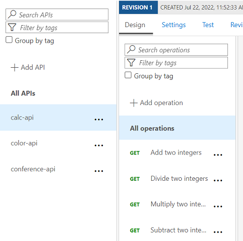
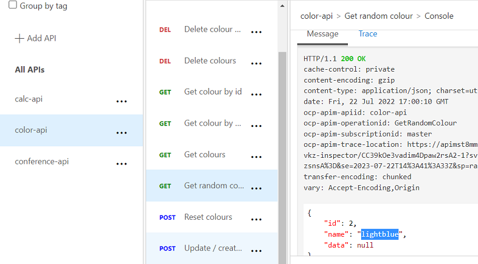

# AZ-204 Demo: Provision APIM from CLI

In the demo you will provision a new APIM instance and add a several Web APIs.
You will also create several products where those APIs added.

## Technical Requirements:
- VS Code
- Azure CLI or Cloud Shell

## Demonstration:

1. Open [**demo.azcli**](demo.azcli) and run line by line.

1. Verify from portal the APIM regested APIs and Products.

    

1. Test Random color API the API from the portal:

    