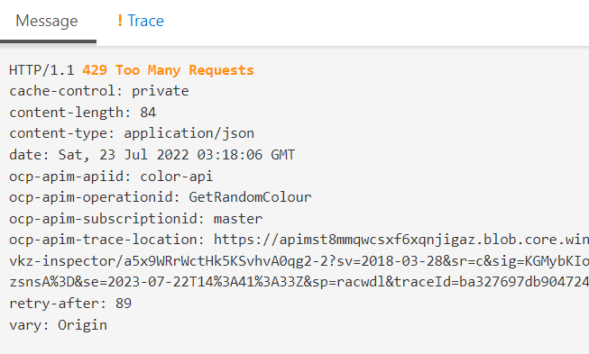
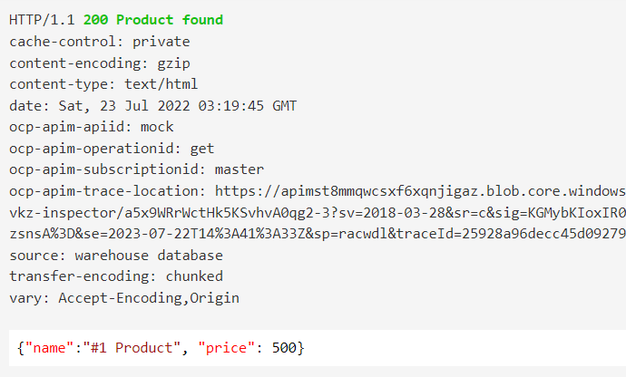

# AZ-204 Demo: Azure APIM policies

In the demo you will construct policies for new APIM instance and add a several Web APIs.

## Technical Requirements

- APIM deployed in previous demo
- AzurCLI or Cloud Shell to run. 

## Demonstration

### Throttle response

1. Open the **Get random colour** Adding throttling for policy to throttle request limit by 1 per 90 second.

       
        <inbound>
        <rate-limit calls="1" renewal-period="90" />
        </inbound>
        
1. To test the policy call the web API more then 1 time per 90 sec to get 429 status code.

### Mocking response.

1. Create new API (but do not import, manually create) with name **mock**.

1. Add new operation named **get** for HTTP GET and path "". 

1. The following policy should replace "<inbound>":

        
                <inbound>
                <return-response>
                <set-status code="200" reason="Product found" />
                <set-header name="source" exists-action="override">
                        <value>warehouse database</value>
                </set-header>
                <set-body>{"name":"#1 Product", "price": 500}</set-body>
                </return-response>
                </inbound>
        

1. The following result should be shown: 

1. The following policy can be added as additional method and required Cosmos DB `Mission` been deployed (demo #2 from Mod #4). The key need to be replaced with your Cosmos Account.

        
        <policies>
        <inbound>
                <base />
                <set-variable name="requestDateString" value="@(DateTime.UtcNow.ToString("r"))" />
                <set-header name="Authorization" exists-action="override">
                <value>@{
                var verb = "POST";
                var resourceType = "docs";
                var resourceId = "dbs/Apollo/colls/Mission";
                var key = "your key";
                var keyType = "master";
                var tokenVersion = "1.0";
                var date = context.Variables.GetValueOrDefault<string>("requestDateString");

                var hmacSha256 = new System.Security.Cryptography.HMACSHA256 { Key = Convert.FromBase64String(key) };  
        
                verb = verb ?? "";  
                resourceType = resourceType ?? "";
                resourceId = resourceId ?? "";
                
                string payLoad = string.Format( "{0}\n{1}\n{2}\n{3}\n{4}\n",  
                        verb.ToLowerInvariant(),  
                        resourceType.ToLowerInvariant(),  
                        resourceId,  
                        date.ToLowerInvariant(),  
                        ""  
                );  
                
                byte[] hashPayLoad = hmacSha256.ComputeHash(System.Text.Encoding.UTF8.GetBytes(payLoad));  
                string signature = Convert.ToBase64String(hashPayLoad);  
                
                return System.Uri.EscapeDataString(String.Format( "type={0}&ver={1}&sig={2}",  
                        keyType,  
                        tokenVersion,  
                        signature));  
                }</value>
                </set-header>
                <set-header name="x-ms-documentdb-isquery" exists-action="override">
                <value>True</value>
                </set-header>
                <set-header name="x-ms-date" exists-action="override">
                <value>@(context.Variables.GetValueOrDefault<string>("requestDateString"))</value>
                </set-header>
                <set-header name="x-ms-version" exists-action="override">
                <value>2015-12-16</value>
                </set-header>
                <set-header name="x-ms-query-enable-crosspartition" exists-action="override">
                <value>True</value>
                </set-header>
                <set-header name="x-ms-documentdb-query-enablecrosspartition" exists-action="override">
                <value>True</value>
                </set-header>
                <set-header name="Content-Type" exists-action="override">
                <value>application/query+json</value>
                </set-header>
                <set-header name="Accept" exists-action="override">
                <value>application/json</value>
                </set-header>
                <rewrite-uri template="dbs/Apollo/colls/Mission/docs" copy-unmatched-params="false" />
        </inbound>
        <backend>
                <send-request mode="copy" response-variable-name="microservice-response" timeout="20" ignore-error="false">
                <!-- Set the method to POST as the backend service MUST receive a POST call-->
                <set-method>POST</set-method>
                <set-body template="liquid">
                {  
                        "query": "SELECT * FROM m",  
                        "parameters": [  ]  
                }             
                </set-body>
                </send-request>
        </backend>
        <outbound>
                <return-response response-variable-name="microservice-response" />
        </outbound>
        <on-error>
                <base />
        </on-error>
        </policies>
       

1. The result should be all documents from Apollo missions. 