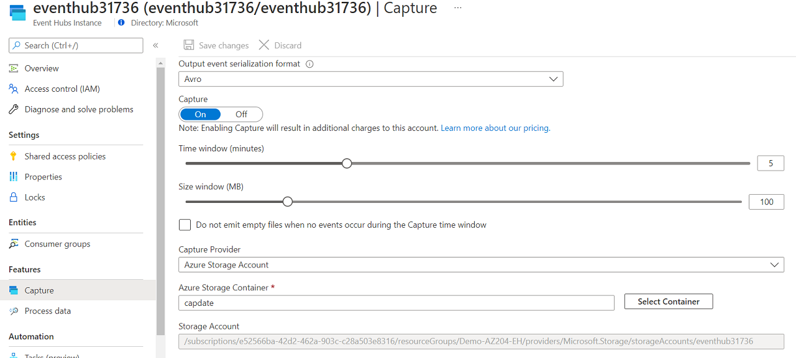

# AZ-204 Demo: Provision Event Hub

In the demo you will provision Event Hub namespace and Event Hub. Then you will setup capturing events in the storage account. You also receive the account connection string.

## Technical Requirements

- Visual Studio Code
- AzurCLI or Cloud Shell to run. 

## Demonstration

1. Open **demo.azcli** and execute line by line.

1. Check from the Portal if the Event Hub created and capturing setup.

