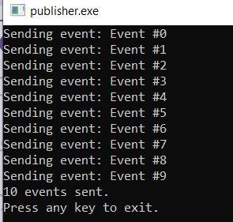
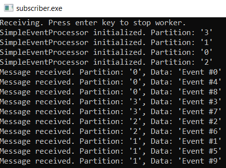

# AZ-204 Demo: Processing events from code

In the demo you will configure publisher and subscriber to submit and receive events.

## Technical Requirements

- Visual Studio Code
- Event Hub provisioned from previous demo.
- AzurCLI or Cloud Shell to run. 

## Demonstration

1. Open **publisher** folder from Visual Studio code. Update `Program.cs` file and add connection string to your Event Hub. 

1. Build and run publisher to submit the events. 

1. Open **subscriber** folder from Visual Studio code.

1. Build and run subscriber to receive the events. 

