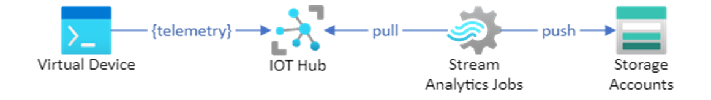
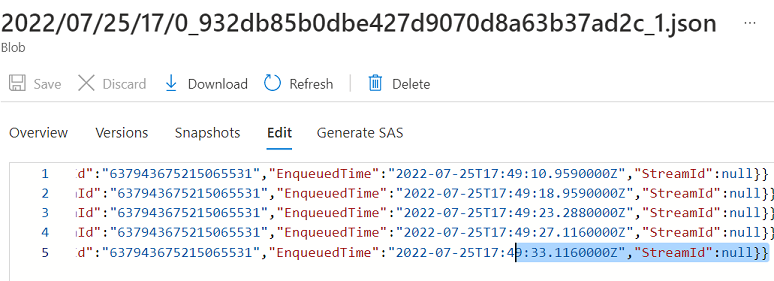

# AZ-204 Demo: IoT Hubs in Action

In the demo you will use provisioned early Event Hub. You will deploy IoT Hub and register device to get connected to the service. You will also provision a Stream Analytics Job to transfer IoT events to the storage account where you can monitor it.

## Technical Requirements

- Visual Studio Code
- AzurCLI or Cloud Shell to run. 
- Provisioned early Event Hub
- configured and compiled console app **subscriber** for previous demo

## Demonstration

1. Open **demo.azcli** and execute line by line to build appropriate resources.

1. Check from the Portal if the IoT Hub and Stream Analytics Job are deployed. 

    

1. Copy the IoT Device connection string from the output of the **demo.azcli** and navigate to https://azure-samples.github.io/raspberry-pi-web-simulator/. Enter the connection string instead of default one in the code and run the IoT device simulation.

1. Observe the results from the Storage account.

    

## Recoding

