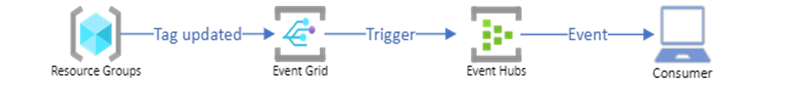
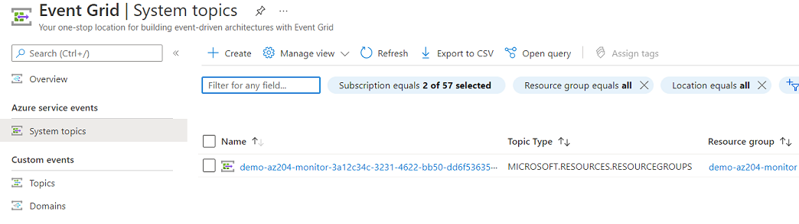
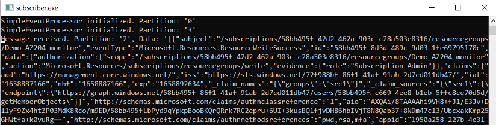

# AZ-204 Demo: Provision Event Grid

In the demo you will provision Event Grid and start monitoring changes in the target resource group. When the changes maid the Event Grid will send notification event to the Event Hub you provisioned in the previous demo and you can monitor the events by leveraging subscriber.

## Technical Requirements

- Visual Studio Code
- Power Shell or Cloud Shell to run. 
- Event Hub provisioned early.
- Event Subscriber connected to the event hub.

## Demonstration

1. Open [**demo.ps1**](demo.ps1) and updat the name of the Event Hub and its resource group. 

1. Execute commands for script line by line.

1. Check from the Portal if the Event Grid system topic provisioned,

   

1. Start Event Hub "subscriber" from Demo #2. 

1. Execute command from [**generate-event.ps1**](generate-event.ps1) to generate the event.

1. Monitor "subscriber", the new event will be received in 1 minute.

    