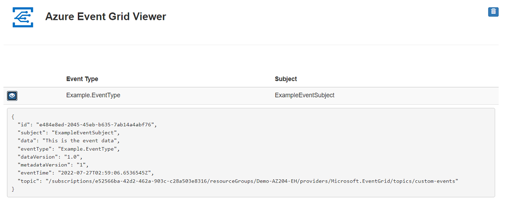

# AZ-204 Demo: Event Grid event submission and handling

In the demo you will provision custom endpoint for Event Grid and Web App that subscribe for events from the endpoint. The web app will help you observe the submitted events. 

## Technical Requirements

- Visual Studio Code
- Azure CLI or Cloud Shell to run. 
- Event Grid provisioned early.

## Demonstration

1. Open [**demo.azcli**](demo.azcli) and execut the commands.
>> If the command `az eventgrid event-subscription create` will fail try to repeat execution all command from Cloud Shell. 

1. Check from the portal if the Event Grid's `Topics`.

1. Open the web app to monitor the events.

1. Open `publisher` folder and update `Program.cs` with the keys received from output of **demo.azcli**

1. Start publisher to generate the event and monitor the web app when the event arrived.

    